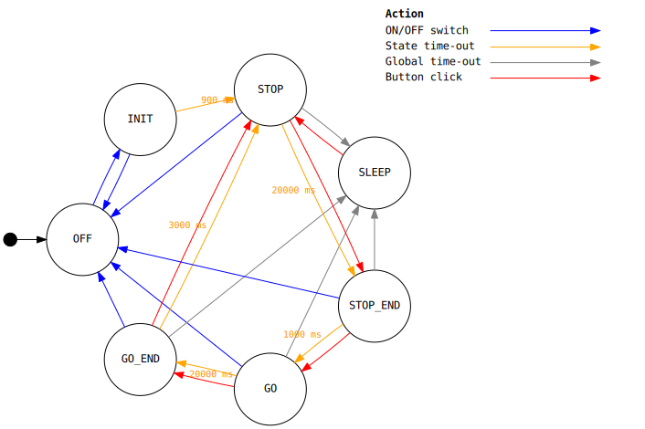

# ATTINY85 traffic light

Simple traffic light implemented using ATTINY85. Lights cycle between configurations and user can move to the next one by pressing a button.

## Software

The code is a PlatformIO project. It basically cycles between states after a timeout. The states are as follows, with possible actions marked with colors:

User can manually move to the next state by pressing a button (the red cycle).
μC will enter deep sleep after 10 minutes since last button press.

### Energy savings

The light runs on a single CR2032 cell (about 220 mAh), so it should consume minimal amounts of energy. Current optimizations are:

* Deep sleep after 10 minutes (commit 0f1c727)
* Disabled ADC (commit dee5303, [blog post](http://www.technoblogy.com/show?KX0))
* Unused pins set to `LOW` (commit dee5303, [forum post](http://gammon.com.au/power))
* Custom fuses settings (commit 2d93b48, [fuse calculator](https://www.engbedded.com/fusecalc/))
  * disabled Brown-Out Detection which does some voltage comparisons
  * 1 MHz clock speed from diving 8 MHz by 8

Remember to set fuses from PlatformIO! It doesn't happen automatically during upload.
