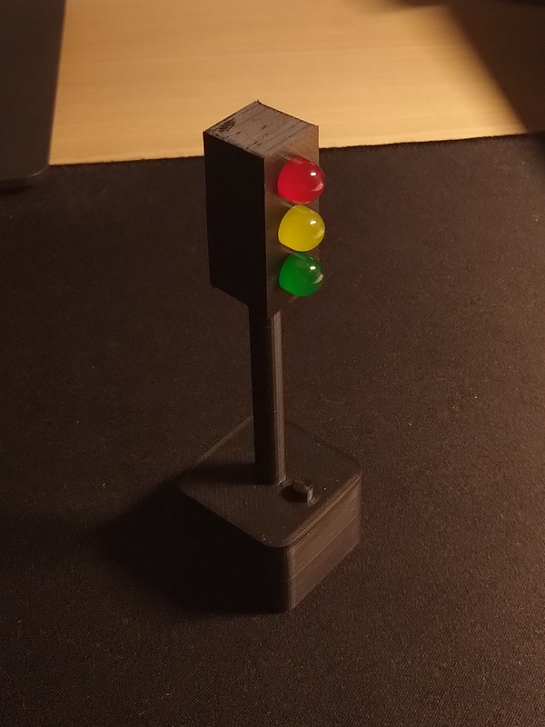
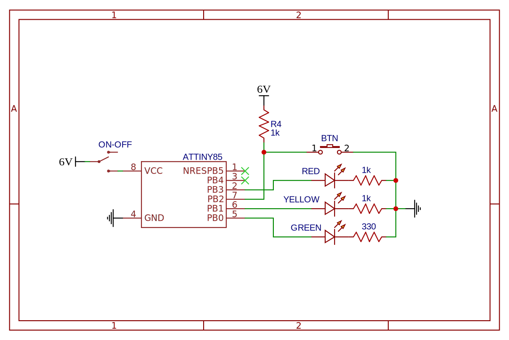
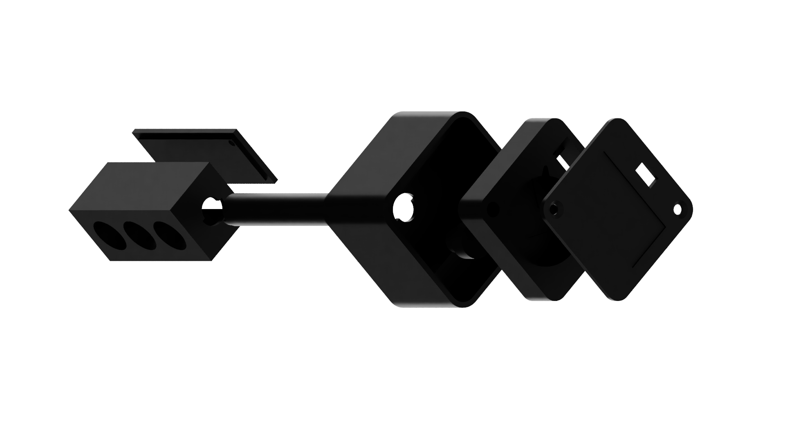

# ATTINY85 traffic light

A simple traffic light implemented using ATTINY85. Lights cycle between configurations and user can move to the next one by pressing a button.

    

## Hardware

### Electronics

I used big, 10 mm LEDs. The green one has ~3.15V forward voltage and thus the second battery. You don't need it for regular LEDs.

BOM:
* ATTINY85 in DIP package;
* 8-leg DIP socket;
* 10 mm LEDs: red, yellow, green;
* 1k, 1k, 330 ohm resistors;
* tactile switch with a pull-up resistor;
* an ON-OFF switch;
* 2x CR2032 battery;
* 20 mm wide PCB.

### Case

Consists of multiple parts for 3D printing in PLA. Print with 20% infill, without supports. See `case/` for Fusion 360 files and exported STLs.

I wanted to make ATTINY85 replaceable and over-engineered a bit.

Case Assembly BOM:
* 2x M2.5x20 flat-head screw (DIN 965);
* 4x M2x12 flat-head screw (DIN 965);
* 4x M2 hex nuts;
* 2x M2.5 threaded insert, height up to 10 mm (goes into the base);
* 2x M2 threaded insert, height up to 6 mm (goes into the lights back);
* 2x office clip 🙂 (cut and bend to make CR2032 contacts).

## Software

The code is a PlatformIO project. It basically cycles between states after a timeout. The states are as follows, with possible actions marked with colors:

User can manually move to the next state by pressing a button (the red cycle).
μC will enter deep sleep after 10 minutes since last button press.

### Energy savings

The light runs on a single CR2032 cell capacity (about 220 mAh), so it should consume minimal amounts of energy. Current optimizations are:

* Deep sleep after 10 minutes (commit 0f1c727)
* Disabled ADC (commit dee5303, [blog post](http://www.technoblogy.com/show?KX0))
* Unused pins set to `LOW` (commit dee5303, [forum post](http://gammon.com.au/power))
* Custom fuses settings (commit 2d93b48, [fuse calculator](https://www.engbedded.com/fusecalc/))
  * disabled Brown-Out Detection which does some voltage comparisons
  * 1 MHz clock speed from diving 8 MHz by 8

Remember to set fuses from PlatformIO! It doesn't happen automatically during upload.

